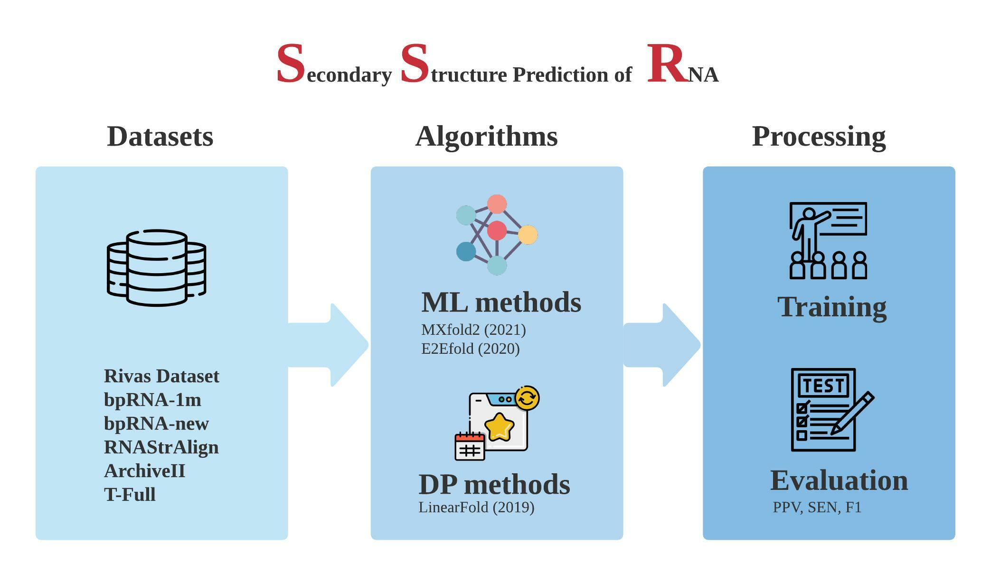

# SSR: A Unifed Framework for Prediction in **S**econdary **S**tructure of **R**NA 
Yanjie Ze*, Qi Liu*, Xudong Lu*


This is the official code for final project of CS410: AI.




# mxfold2和linear fold编译过程

```
cd novafold/models/mxfold2/src/
git submodule update --init
rm -rf CMakeFiles
rm CMakeCache.txt
rm cmake_install.cmake
mkdir build
cd build
cmake ..
make
```

# 用script跑样例

```
sh scripts/train_mxfold2.sh
```


